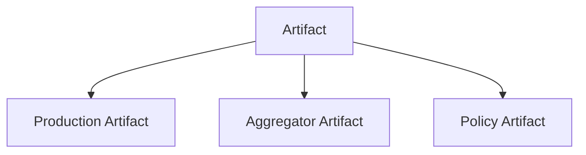
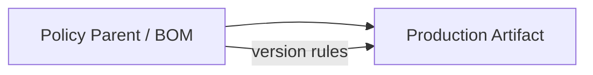
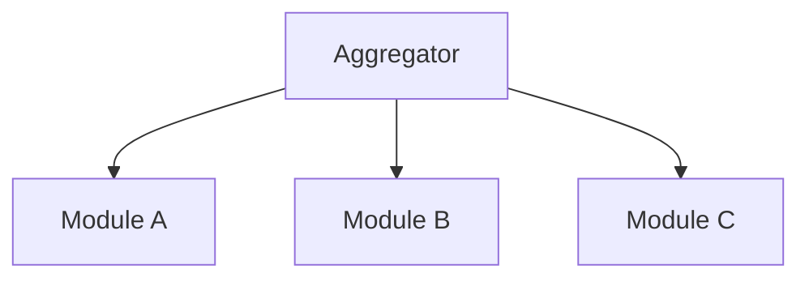
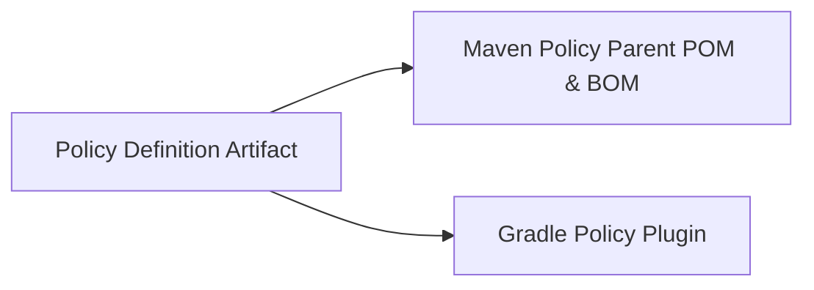
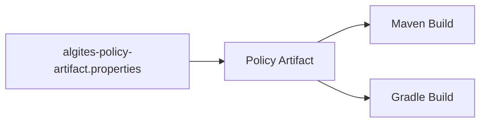

[[FINAL-APPROVED]]
# Algites Repository and Artifact Naming Standard
**Version:** 1.7
**Status:** Normative
**Scope:** All repositories and build artifacts within the Algites ecosystem

## 1. Introduction

---

## 2. Namings

### 2.1. Purpose

This document defines a unified and normative standard for naming:

- Git repositories,
- Maven/Gradle artifacts (JARs),
- and related identifiers

across the Algites platform, tools, libraries, products, and customer solutions.

The goals are:

- **Semantic clarity** – names must express domain and purpose.
- **Consistency** – the same concepts are named the same way everywhere.
- **Uniqueness** – artifacts must be identifiable without collisions.
- **Scalability** – the standard must support long-term growth.
- **Governance visibility** – public vs private scope must be immediately visible where needed.

---

### 2.2. Terminology

- **Visibility** – governance scope of a repository or artifact (`pub` or `priv`).
- **Role** – technical role of a repository or artifact (`pltf`, `app`, `lib`, `tool`, `frmw`, etc.).
- **BusinessName** – PascalCase domain or product/application concept (e.g., `Modustro`, `MyGreatProduct`).
- **RepoSubname** – optional lowercase technical qualifier of a repository (e.g., `common`, `core`, `backend`).
- **Module Path** – dot-separated identifier of a module or component within a repository.
  It consists of zero or more **module path folders** followed by a mandatory **module root folder**:
  `[<folders>.]<moduleroot>` (e.g., `mymodule.blfacadeintf`, `tools.profiler`, `build.parent`).
- **Module Root Folder** – the last segment of the module path that identifies the primary module name.
- **Variant** – a suffix identifying a specialized flavor of a module (e.g., `tests`).
- **Artifact** – a build output, typically a JAR published to a Maven repository.

---

### 2.3. Repository Naming

#### 2.3.1 Canonical Form

Repositories MUST be named using the following structure:

```
<vis>.<role>.<BusinessName>[.<reposubname>]
```

Where:

- `<vis>` = `pub` | `priv` (lowercase)
- `<role>` = technical role (lowercase)
- `<BusinessName>` = PascalCase business or domain name
- `<reposubname>` = optional lowercase technical qualifier

#### 2.3.2 Case Rules

- `vis` and `role` MUST be lowercase.
- `BusinessName` MUST be PascalCase.
- All `reposubname` components MUST be lowercase.

#### 2.3.3 Examples

```
pub.pltf.Modustro
priv.app.Modustro
priv.lib.Customers.common
pub.tool.Java
priv.tool.Java
```

---

### 2.4. Artifact Naming (artifactId)

#### 2.4.1 Canonical Form

Each artifactId MUST be composed of:

```
<vis>.<role>.<BusinessName[.reposubname]>_<module.path>[-<variant>]
```

Where:

- the part before `_` identifies the **repository root**,
- the part after `_` identifies the **module within the repository**,
- `<module.path>` follows the form `[<folders>.]<moduleroot>`,
- `-<variant>` is an OPTIONAL suffix identifying a variant of the module root (e.g., `tests`),
- `_` is a mandatory separator between repository identity and module path.

#### 2.4.2 Case Rules

- `<vis>`, `<role>`, `<reposubname>`, all module path folders, module root, and `<variant>` MUST be lowercase.
- `<BusinessName>` MUST preserve PascalCase from the repository name.
- The underscore `_` MUST be used exactly once in the artifactId.
- The variant suffix, if present, MUST be appended using `-`.

#### 2.4.3 Examples

From repository:

```
pub.pltf.Modustro
```

Artifacts:

```
pub.pltf.Modustro_core
pub.pltf.Modustro_languages
pub.pltf.Modustro_mps.plugin
```

From repository:

```
priv.lib.Customers.common
```

Artifacts:

```
priv.lib.Customers.common_aaa.blfacadeintf
priv.lib.Customers.common_aaa.blfacadeintf-tests
priv.lib.Customers.common_aaa.other
```

From repositories:

```
pub.tool.Java
priv.tool.Java
```

Artifacts:

```
pub.tool.Java_build.parent
pub.tool.Java_tools.profiler

priv.tool.Java_build.parent
priv.tool.Java_tools.profiler
```

---

### 2.5. groupId Naming

#### 2.5.1 Canonical Form

groupId MUST follow:

```
eu.algites.<role>.<businessname-lc>[.<reposubname>]
```

Where `<businessname-lc>` is the lowercase form of the BusinessName.

#### 2.5.2 Case Rules

All groupId components MUST be lowercase.

#### 2.5.3 Visibility Rule

Visibility (`pub` | `priv`) MUST NOT be part of the groupId.

The groupId expresses only the **business and technical domain**, not governance.

#### 2.5.4 Examples

```
eu.algites.pltf.modustro
eu.algites.app.modustro.studio
eu.algites.lib.customers
eu.algites.lib.customers.common
eu.algites.tool.java
```

---

### 2.6. Visibility and Artifact Identity

Visibility represents **governance and distribution scope**.

#### 2.6.1 Rules

Visibility MUST:

- be part of the **repository name**,
- be part of the **artifactId**,
- influence CI/CD and publishing targets.

Visibility MUST NOT:

- be part of the **groupId**.

#### 2.6.2 Rationale

Including visibility in the artifactId provides:

- immediate visual distinction in dependency trees and logs,
- early detection of accidental use of private artifacts in public builds,
- clear auditability of JAR files by name alone.

---

### 2.7. Variant Suffix Rules

#### 2.7.1 Purpose

Variants represent specialized flavors of a module root that are published as independent artifacts,
most notably shared test artifacts. It SHOULD be used whenever products that would otherwise be
distinguished only by a build classifier require their transitive dependencies to be tracked and
resolved by Maven/Gradle.

#### 2.7.2 Reserved Variants

The following variant suffixes are RESERVED:

- `tests` – shared tests for the base module root.

Additional variants (e.g., `it`, `bench`) MAY be introduced if documented.

#### 2.7.3 Terminal Rule

Artifacts with variant suffix `-tests` MUST be terminal:

- They MUST NOT define or publish further variants.
- In particular, `*-tests-tests` MUST NOT exist.

This prevents recursive test variants and aligns with Maven idioms where `-tests` denotes a test flavor.

#### 2.7.4 Rationale

The `-tests` suffix intentionally mirrors the common Maven convention
`<artifactId>-tests-<version>.jar` used for test classifiers, while elevating it to a
first-class artifact to enable transitive sharing of test dependencies.

---

### 2.8. Mapping Rules

#### 2.8.1 From Repository to Artifact Root

Given repository:

```
<vis>.<role>.<BusinessName>[.<reposubname>]
```

Artifact root becomes:

```
<vis>.<role>.<BusinessName>[.<reposubname>]
```

and the artifactId is completed by appending:

```
_<module.path>[-<variant>]
```

#### 2.8.2 From BusinessName to groupId

BusinessName is normalized to lowercase:

```
Modustro -> modustro
Customers -> customers
Java -> java
```

---

### 2.9. JAR Naming

The resulting JAR file name MUST follow Maven convention:

```
<artifactId>-<version>.jar
```

Examples:

```
pub.pltf.Modustro_core-1.2.0.jar
priv.lib.Customers.common_bai.blfacadeintf-1.0.0.jar
priv.lib.Customers.common_bai.blfacadeintf-tests-1.0.0.jar
pub.tool.Java_build.parent-1.4.0.jar
```

---

### 2.10. Repository/Artifact Roles (Recommended Set)

Common roles include:

- `pltf` – platform - Algites platform components
- `app` – application - concrete applications
- `lib` – reusable libraries
- `tool` – build and development tools
- `frmw` - framework – generic frameworks
- `lab` – laboratory - experimental or laboratory work

New roles MAY be introduced but MUST be lowercase and documented.

---

### 2.11. CI/CD Governance

CI pipelines MUST:

- infer visibility from repository name prefix (`pub.` vs `priv.`),
- enforce that artifactId starts with the same visibility prefix and follows the `_` separator rule,
- enforce variant rules, including the terminal nature of `-tests`,
- publish artifacts to the corresponding Maven repository:
  - public repo for `pub.*`,
  - private repo for `priv.*`.

groupId MUST remain identical for public and private variants within the same domain.

---

### 2.12. Migration Rule

When migrating legacy projects:

- Preserve BusinessName and structure where possible.
- Align repository names to this standard.
- ArtifactId MUST be adapted to include visibility, the `_` separator,
  and, where applicable, the `-tests` variant suffix.

---

### 2.13. Rationale

This standard balances:

- **Domain identity** (PascalCase BusinessName),
- **Technical structure** (lowercase qualifiers),
- **Practical build compatibility** (lowercase groupId),
- **Governance clarity** (visibility in repository and artifactId),
- **Human auditability** (pub/priv visible in JAR names),
- **Structural readability** (explicit `_` separator between repo and module identity),
- **Maven idioms** (use of `-tests` for test variants),
- **Module semantics** (explicit distinction between module path folders and module root).

It follows proven historical patterns used in legacy conventions such as:

```
lib.Customers.common.aaa.blfacadeintf
```

while extending them with explicit visibility and repository/module separation semantics.

---

### 2.14. Summary

- Repositories express **visibility + role + business identity**.
- Artifacts express **visibility + role + business identity + module specialization**, separated by `_`.
- `<module.path>` is composed of optional path folders and a mandatory module root.
- Optional variant suffixes (e.g., `-tests`) express specialized flavors of the module root.
- `-tests` is terminal and MUST NOT be nested.
- groupId expresses **organizational and domain namespace only**.
- Visibility is part of artifact identity, but not of groupId.
- BusinessName remains PascalCase across repos and artifacts.
- The `_` separator cleanly delineates repository identity from module identity.

This standard is normative for all Algites projects.

---

## 3. Algites Artifact Structure

### 3.1. Artifact Types and Roles

This chapter defines the structural classification of artifacts used within the Algites ecosystem.
Artifact types are **not interchangeable**; each type has a clearly defined role, lifecycle, and set of constraints.
The distinction between artifact types is fundamental for achieving consistent behavior across Maven- and Gradle-based builds.

---

#### 3.1.1 General Artifact Classification

All Algites repositories and projects MUST classify each artifact into exactly one of the following high-level types:

- **Production Artifact**
- **Aggregator Artifact**
- **Policy Artifact**
- **BOM Artifact**

Each artifact type:
- has a distinct purpose,
- participates differently in dependency resolution and build execution,
- and is subject to different governance and lifecycle rules.

Artifact type MUST be identifiable by its structure and declared role, not by naming conventions alone.



---

#### 3.1.2 Production Artifacts

Production artifacts represent deliverables that contain executable or consumable functionality.

##### 3.1.2.1 Definition

A Production Artifact is an artifact that:
- contains source code and/or resources,
- produces a runtime or compile-time deliverable (e.g. JAR),
- is intended to be consumed by other artifacts or applications.

##### 3.1.2.2 Characteristics

Production artifacts:
- MUST NOT define concrete dependency versions directly.
- MUST rely on inherited or imported version policy.
- MAY define plugin configuration, but MUST reference plugin versions via inherited properties.

##### 3.1.2.3 Maven Representation

In Maven, a Production Artifact:
- uses a policy parent POM or imports a policy BOM,
- declares dependencies without hardcoded versions,
- MAY declare plugin `<version>` elements ONLY via inherited properties.

##### 3.1.2.4 Gradle Representation

In Gradle, a Production Artifact:
- applies a policy Gradle plugin,
- declares dependencies without versions,
- MUST NOT read version definition files directly.



---

#### 3.1.3 Aggregator Artifacts

Aggregator artifacts provide structural grouping and coordinated build execution.

##### 3.1.3.1 Definition

An Aggregator Artifact is an artifact that:
- exists to group multiple artifacts,
- does not represent a deliverable on its own,
- orchestrates build execution across its children.

##### 3.1.3.2 Characteristics

Aggregator artifacts:
- MAY contain no source code.
- MUST NOT define dependency versions.
- MUST NOT introduce build policy.
- MUST NOT be used as dependency targets.

##### 3.1.3.3 Maven Representation

In Maven, an Aggregator Artifact:
- has `packaging = pom`,
- lists child modules via `<modules>`,
- is not intended to be referenced as a parent for policy purposes.

##### 3.1.3.4 Gradle Representation

In Gradle, an Aggregator Artifact:
- is represented by a composite build or multi-project root,
- declares included projects in `settings.gradle(.kts)`,
- delegates build logic to included modules.



---

#### 3.1.4 Policy Artifacts

Policy artifacts define shared structural, versioning, and build rules.

##### 3.1.4.1 Definition

A Policy Artifact is an artifact that:
- defines version and/or build policy,
- produces no runtime functionality,
- serves as a governance contract for dependent artifacts.

Policy artifacts are the **only location** where version definitions are allowed.

##### 3.1.4.2 Responsibilities

Policy artifacts:
- define dependency versions symbolically,
- define plugin versions symbolically,
- provide enforcement and validation rules,
- ensure consistency across the artifact graph.

##### 3.1.4.3 Maven Representation

In Maven, a Policy Artifact plays the role of:
- a **policy parent POM** (for inheritance),
- as well as **policy BOM** (for import-based usage).

##### 3.1.4.4 Gradle Representation

In Gradle, a Policy Artifact produces:
- a **policy Gradle plugin**.

The policy plugin:
- applies dependency constraints or platforms,
- injects shared repositories and build conventions,
- enforces version and structural rules.



---

#### 3.1.5 BOM Artifacts

BOM artifacts (Bill Of Materials) are **POM-packaged** artifacts whose primary purpose is to provide **version alignment** (and only version alignment) to consumers. They are published to the Maven repository alongside production artifacts and may be consumed by both Maven and Gradle builds.

This section standardizes Algites BOM terminology, responsibilities, generation rules, and usage patterns. It also clarifies why different BOM categories exist and what problems each category solves.

> **Key principle:** A “BOM” is not one thing. In Algites we distinguish three BOM categories with different semantics and lifecycle:
>
> - **Product Background BOM (PBB)** — generated, hierarchical, background version alignment for *framework-independent* external components used by the product.
> - **Product Plain BOM (PPB)** — curated, library/product catalog of the product’s own modules.
> - **Product Variant BOM (PVB)** — curated, opinionated platform/stack BOM combining multiple options into one specific product variant.

---

##### 3.1.5.1 Definitions and scope

###### 3.1.5.1.1 What a BOM is (in Algites)

A BOM is an artifact with:

- `packaging = pom`
- a `dependencyManagement` section listing dependency coordinates with pinned versions
- **no compiled code**
- intended consumption via Maven **import scope** (or equivalent mechanisms in Gradle)

A BOM **does not add dependencies** by itself. It only defines versions to be used *if* the consumer declares the dependency without a version.

###### 3.1.5.1.2 What a BOM is not

A BOM is **not**:

- a build convention carrier (that is the role of a parent POM)
- a plugin configuration carrier (pluginManagement belongs to parent POMs)
- a “complete build setup” (CI/build tooling is handled elsewhere)
- a replacement for product documentation or curated compatibility matrices (except where explicitly modeled as PVB)

###### 3.1.5.1.3 Maven compatibility boundary

Maven semantics impose important constraints:

- `dependencyManagement` is applied to dependencies declared in the consuming project.
- `<scope>test</scope>` dependencies are **not transitive** and should not be relied on for sharing test dependencies.
- Version alignment is a **consumer-side** mechanism: consumers can still override versions explicitly (which may break compatibility). BOMs reduce risk; they do not technically prevent misuse.

---

##### 3.1.5.2 BOM categories (Algites standard)

###### 3.1.5.2.1 Product Background BOM (PBB)

#### Purpose

The **Product Background BOM (PBB)** provides a **shared version background** for components that must remain *framework-independent* (e.g., plugins, adapters, generic interfaces), yet must be developed against a consistent ecosystem background to avoid classpath conflicts when later integrated into a product/framework runtime.

Typical use-case:

- A component does **not** depend on Spring (or any specific framework) at compile time.
- The component will later be loaded/used within a Spring-based application (or another framework runtime).
- To avoid runtime conflicts (logging, annotations, bytecode libs, Jakarta/Javax split, etc.), the component is built against the same **background alignment** as the target platform.

#### Characteristics

- **Generated automatically** from a Policy Artifact.
- **Hierarchical** (imports parent PBBs) to keep background alignment consistent across inherited policies.
- Contains only **background** dependencies (no “product module catalog”).
- Intended primarily for **component developers** and integration layers.

#### Hierarchy rule (normative)

If policy `Y` inherits from policy `X`, then:

- `PBB-Y` **MUST import** `PBB-X` (exact aligned version), and
- `PBB-Y` **MAY add** additional background constraints specific to policy `Y`.

This creates a deterministic, layered background alignment while keeping the policy inheritance semantics explicit.

#### Maven usage example

```xml
<dependencyManagement>
  <dependencies>
    <dependency>
      <groupId>eu.algites.policy</groupId>
      <artifactId>algites-pbb-y</artifactId>
      <version>Y_VERSION</version>
      <type>pom</type>
      <scope>import</scope>
    </dependency>
  </dependencies>
</dependencyManagement>
```

#### Gradle usage example

In Gradle, you typically consume the corresponding alignment through a version catalog or a platform import. When publishing to Maven repos, Gradle projects can still import BOMs via dependency constraints (platform).

```kotlin
dependencies {
  implementation(platform("eu.algites.policy:algites-pbb-y:Y_VERSION"))
}
```

#### What belongs into PBB (guideline)

Include “background” libraries that commonly cause classpath/version conflicts across ecosystems, for example:

- logging APIs and bridges
- annotations libraries
- bytecode / proxy libs
- jakarta/jaxb/jaxrs stacks (where relevant)
- JSON core libs (if used broadly as infrastructure)
- common utility libraries that should be aligned across the runtime

Exclude:

- product module catalogs (those belong to PPB)
- opinionated application stacks (those belong to PVB)

---

###### 3.1.5.2.2 Product Plain BOM (PPB)

#### Purpose

The **Product Plain BOM (PPB)** is the **product/library curated catalog BOM**. It enumerates the product’s own published modules so that consumers can declare them without specifying versions, while remaining neutral about external stacks.

Example: A Spring Framework-style BOM enumerating Spring modules.

#### Characteristics

- **Curated manually** (or semi-automated with curated inputs).
- Enumerates **product artifacts** (the modules that the product provides).
- Typically **non-hierarchical** as a BOM (no implicit inheritance). It may be versioned as part of the product release.
- Does not attempt to define a full application stack; it stays within the product boundary.

#### Why PPB is not auto-generated from Policy Artifacts

A Policy Artifact typically defines version decisions and generation parameters. PPB needs an explicit, curated decision of:

- which artifacts are considered “public product modules”
- which modules are stable to advertise to consumers
- which optional modules are included/excluded

This is product ownership, not policy ownership.

#### Maven usage example

```xml
<dependencyManagement>
  <dependencies>
    <dependency>
      <groupId>eu.algites.product</groupId>
      <artifactId>product-ppb</artifactId>
      <version>PRODUCT_VERSION</version>
      <type>pom</type>
      <scope>import</scope>
    </dependency>
  </dependencies>
</dependencyManagement>
```

#### Product dependency declaration example

After importing PPB, consumers can declare product modules without versions:

```xml
<dependency>
  <groupId>eu.algites.product</groupId>
  <artifactId>product-core</artifactId>
</dependency>
```

#### What belongs into PPB (guideline)

Include:

- all public modules of the product that are intended for direct consumption
- versions for these modules (aligned to the product release)

Exclude:

- unrelated ecosystem stacks (Hibernate/JOOQ/etc.) unless they are product modules
- build plugins, plugin configuration, profiles (that belongs to parent POM)
- transitive “background alignment” beyond what is needed for the product’s own modules (that belongs to PBB/PVB depending on intent)

---

###### 3.1.5.2.3 Product Variant BOM (PVB)

#### Purpose

The **Product Variant BOM (PVB)** defines an **opinionated, compatible platform stack assembling one specific product variant**. It is a “ready-to-use” variant that combines multiple products/frameworks into a coherent set of versions.

Example: Spring Boot style BOM that aligns Spring + Hibernate + Jackson + embedded container + logging stack.

#### Characteristics

- **Curated manually** (product/platform decision).
- May **import multiple BOMs** (PPB/PBB/other third-party BOMs) or may materialize constraints directly.
- Intended for application teams who want a “known-good stack” with minimal version decision overhead.

#### Why PVB is not auto-generated from Policy Artifacts

A PVB is a policy decision plus a product/platform decision:

- It selects a variant (e.g., Hibernate vs iBatis vs jOOQ)
- It defines compatibility expectations across ecosystems
- It becomes a published “platform contract”

This needs explicit ownership and review; automatic generation from a generic policy file is insufficient.

#### Maven usage example

```xml
<dependencyManagement>
  <dependencies>
    <dependency>
      <groupId>eu.algites.platform</groupId>
      <artifactId>platform-pvb-hibernate</artifactId>
      <version>PLATFORM_VERSION</version>
      <type>pom</type>
      <scope>import</scope>
    </dependency>
  </dependencies>
</dependencyManagement>
```

#### Variant example

Different variants are different PVBs:

- `platform-pvb-hibernate`
- `platform-pvb-ibatis`
- reminding that variants are a deliberate contract and must be versioned and communicated.

---

##### 3.1.5.3 Relationship to Parent POMs

###### 3.1.5.3.1 Parent POM role

Parent POMs carry build and project conventions:

- pluginManagement
- properties (often including versions)
- profiles and build defaults
- organization-level metadata

They are applied via Maven’s `<parent>` mechanism (inheritance). Only one parent can be used directly, which is why BOM import exists.

###### 3.1.5.3.2 Why BOM and parent POM can share dependencyManagement

It is common that a parent POM and a BOM contain **similar** `dependencyManagement`. However, the artifacts serve different consumers:

- Parent POM: internal project inheritance (build conventions)
- BOM: external or flexible consumption (version alignment without inheritance)

Algites allows generating both where appropriate, but the category determines intended usage:

- PBB: generated background alignment (BOM import)
- PPB: curated product module catalog
- PVB: curated platform stack

###### 3.1.5.3.3 Importing a parent POM as a BOM

Maven permits importing any POM via `<scope>import</scope>` and will effectively use its `dependencyManagement`. While this may work mechanically, Algites treats this as a **non-standard** and **discouraged** practice for published contracts, because it couples version alignment to an artifact whose primary role is build convention.

**Normative recommendation:** publish a BOM (PBB/PPB/PVB) for version alignment use-cases, and keep parent POMs for inheritance.

(Internal exceptions may exist for purely private builds, but should be documented explicitly as such.)

---

##### 3.1.5.4 Generation rules

###### 3.1.5.4.1 Policy Background BOM generation (PBB)

- PBB artifacts **MUST** be generated from Policy Artifacts.
- PBB generation is deterministic:
  - inputs: `algites-policy-artifact.properties` + templates
  - outputs: `pbb.pom` (and optionally metadata)
- If policy `Y` inherits from policy `X`:
  - `PBB-Y` **MUST import** `PBB-X`.

###### 3.1.5.4.2 PPB and PVB creation

- PPB and PVB artifacts are **manual/curated** by design.
- Automation may assist (e.g., scanning published modules), but the final curated list and variant definition is owned by the product/platform maintainers.

---

##### 3.1.5.5 Versioning and compatibility expectations

###### 3.1.5.5.1 Version alignment intent

- BOM version indicates a compatibility set.
- If a consumer overrides versions (explicit `<version>`), compatibility may be broken.
- Policy aims to reduce risk, not enforce it at runtime.

###### 3.1.5.5.2 When to bump BOM versions

- PBB: whenever background constraints change (including upgrades of background libraries)
- PPB: aligned with product releases and public module changes
- PVB: aligned with platform releases and variant changes

---

##### 3.1.5.6 Usage guidelines (Do / Don’t)

###### 3.1.5.6.1 Do

- Use **PBB** when developing framework-independent components that must remain compatible with a target runtime background.
- Use **PPB** when consuming a product/library’s modules without pinning per-module versions.
- Use **PVB** when you want a complete, opinionated platform stack with minimal version decisions.

###### 3.1.5.6.2 Don’t

- Don’t treat PPB as a platform stack BOM (keep it product-scoped).
- Don’t overload PBB with product module catalogs.
- Don’t rely on transitive test dependencies; if shared tests are needed, publish explicit `*-tests` artifacts.

---

##### 3.1.5.7 Practical notes for Gradle-only builds with Maven consumers

###### 3.1.5.7.1 Publishing to Maven repositories

When building with Gradle as the single authoritative build tool:

- Gradle publishes standard Maven artifacts:
  - `jar` (where applicable)
  - `pom` with correct dependency scopes
- Maven consumers can use the published artifacts normally.
- Test dependencies are not part of published POM contracts (by ecosystem design). Shared tests must be modeled explicitly via dedicated `*-tests` artifacts if needed.

###### 3.1.5.7.2 Policy artifacts vs production artifacts

- Policy artifacts produce/host PBB outputs and policy parents.
- Production artifacts consume the selected policy via BOM import (PBB/PVB) and/or parent inheritance (internal conventions).
- Keep policy and production concerns separated to minimize coupling and to make compatibility management explicit.

---

##### 3.1.5.8 Appendix: Naming suggestions (non-normative)

This appendix proposes consistent naming patterns; projects may adjust to existing Algites naming standards.

- Policy Background BOM:
  - `algites-<policy>-pbb`
- Product Plain BOM:
  - `algites-<product>-ppb`
- Platform Variant BOM:
  - `algites-<platform>-pvb-<variant>`

Examples:

- `algites-core-pbb`
- `algites-spring-ppb`
- `algites-platform-pvb-hibernate`


---

#### 3.2. Project Build

#### 3.2.5 Maven and Gradle Unification Model

The Algites build model enforces semantic equivalence between Maven and Gradle.

##### 3.2.5.1 Unified Semantics

The following concepts MUST be equivalent across tools:

- Maven parent POM ↔ Gradle policy plugin
- Maven dependencyManagement ↔ Gradle dependency constraints/platforms
- Maven pluginManagement ↔ Gradle convention plugins

##### 3.2.5.2 Single Source of Truth

Version definitions:
- MUST originate from a policy artifact.
- MUST NOT be duplicated across tools.
- MUST be applied consistently regardless of build system.



---

#### 3.2.6 Version and Build Policy Inheritance

Policy artifacts MAY inherit from other policy artifacts.

##### 3.2.6.1 Policy Layering

Policy inheritance:
- MUST be explicit,
- MUST be linear and deterministic,
- MUST preserve previously defined policy constraints unless explicitly overridden.

##### 3.2.6.2 Transitive Effects

All artifacts consuming a policy artifact:
- inherit its version and build rules,
- are subject to its enforcement constraints,
- MUST remain compatible with its declared policy scope.

---

##### 3.2.6.3 Policy Artifacts vs Product Artifacts

Policy artifacts are a distinct class of artifacts whose sole purpose is to define, generate, and enforce development and build policies. Product artifacts consume these policies and must not define their own versions or policy rules.

###### 3.2.6.3.1 Policy Artifact Identification

A policy artifact is **explicitly identified** by the presence of the marker file:

```
algites-policy-artifact.properties
```

The existence of this file alone classifies the repository as a *policy artifact*. No additional metadata is required to identify the artifact type.

###### 3.2.6.3.2 Role of algites-policy-artifact.properties

The file `algites-policy-artifact.properties` serves a dual purpose:

1. **Marker** – identifies the repository as a policy artifact
2. **Data source** – defines all version and policy-related properties used during generation

Policy artifacts must not use `algites-versions.properties`. Product artifacts must not contain `algites-policy-artifact.properties`.

---

##### 3.2.6.4 Policy Artifact Structure Convention

All policy artifacts MUST follow a strictly standardized internal structure.

```
/
├─ algites-policy-artifact.properties
├─ build.gradle.kts
├─ pom.xml
└─ src/
   ├─ maven/
   │  └─ pom.xml.tpl
   └─ gradle/
      └─ plugin.kts.tpl
```

All build logic (`build.gradle.kts`, generation tasks, CI expectations) is identical across policy artifacts. Only the following may differ:

- Contents of `algites-policy-artifact.properties`
- Contents of template files
- GroupId / ArtifactId / Version of the policy artifact itself

---

##### 3.2.6.5 Version Definition Model

All versions used across the ecosystem are defined **exclusively** inside policy artifacts.

Product artifacts must never declare literal versions.

###### 3.2.6.5.1 Named Versions (Preferred)

Named versions are intended to be shared by multiple dependencies.

```
version.junit=5.10.2
version.spring.boot=3.3.1
version.kotlin=1.9.25
```

These versions are referenced from Maven and Gradle builds via properties only.

###### 3.2.6.5.2 Artifact-Specific Versions (Exceptional)

When a dependency requires an independent lifecycle, an artifact-specific version MAY be defined.

Key format:

```
version_<groupId>_<artifactId>=<value>
```

Normalization rules:
- GroupId retains dots (`.`)
- ArtifactId replaces hyphens (`-`) with underscores (`_`)
- Separator between groupId and artifactId is `_`

Example:

```
version_eu.algites.tool.build_pub_build_base=2025.01
```

Artifact-specific versions must be used sparingly and only when shared versions are not appropriate.

---

##### 3.2.6.6 Version Enforcement Rules

The following rules are enforced during build and CI verification:

- Literal versions are forbidden in product artifacts
- All version references must resolve to properties provided by the policy artifact
- Any unresolved version placeholder causes immediate build failure
- Policy artifacts are the single source of truth for version data

These rules apply uniformly to Maven and Gradle builds.

[[/FINAL-APPROVED]]

